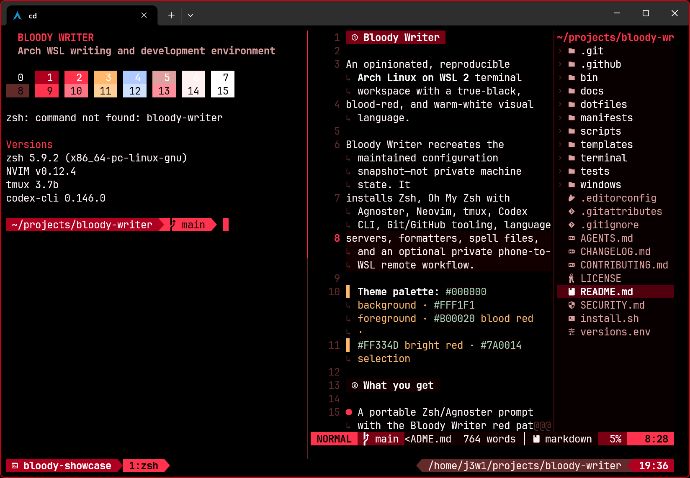
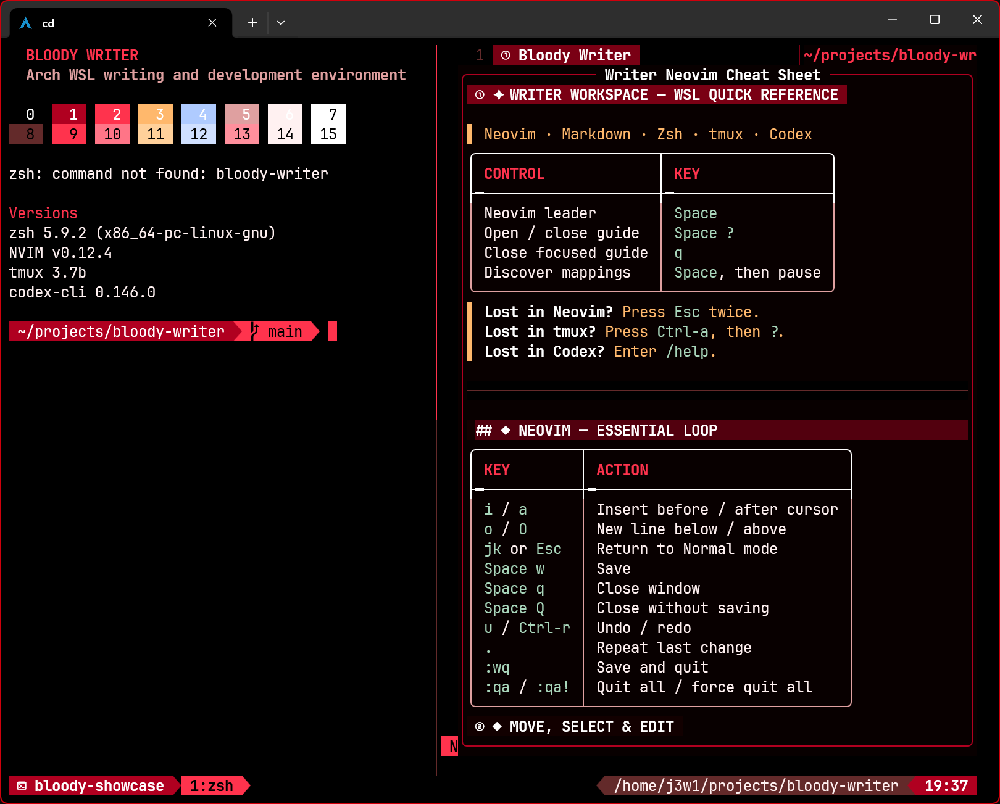
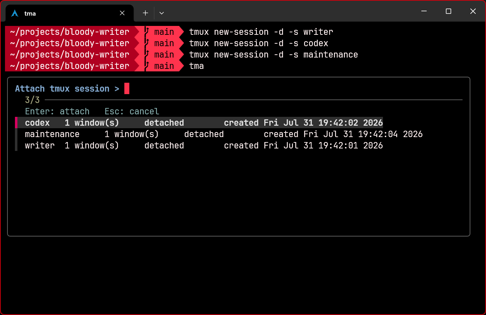

<p align="center">
  
</p>

<h1 align="center">Bloody Writer</h1>

<p align="center">
  <strong>Write boldly. Resume safely.</strong><br>
  One dark red terminal workspace for Arch Linux on Windows WSL 2 and Termux on Android.
</p>

<p align="center">
  <a href="https://github.com/1w3j/bloody-writer/actions/workflows/ci.yml"></a>
  <a href="LICENSE"></a>
  
  
</p>

<p align="center">
  
</p>

Bloody Writer turns a fresh terminal into a maintained writing and coding workstation. It brings
together Zsh, Oh My Zsh, tmux, Neovim, GitHub, SSH, language tools, documentation, and a
resumable installer—without copying passwords, private keys, tokens, projects, or machine state.

Like Oh My Zsh, the repository is both a configuration framework and a living source of truth.
Unlike a shell-only framework, Bloody Writer manages the complete terminal experience and knows
which host it is running on.

> [!IMPORTANT]
> Read the platform notes and inspect `scripts/phases/` before installing. The WSL path performs
> visible `sudo` operations; the Termux on Android path never requires root.

<details>
<summary><strong>Table of contents</strong></summary>

- [What you get](#what-you-get)
- [Platform support](#platform-support)
- [Install on Windows WSL](#install-on-windows-wsl)
- [Install in Termux on Android](#install-in-termux-on-android)
- [Pause, fix, and resume](#pause-fix-and-resume)
- [Daily commands](#daily-commands)
- [Showcase](#showcase)
- [Updates and customization](#updates-and-customization)
- [Working with AI agents](#working-with-ai-agents)
- [Security boundary](#security-boundary)
- [Documentation](#documentation)

</details>

## What you get

| Layer | Capability |
|---|---|
| **Shell** | Zsh, pinned Oh My Zsh, Agnoster, portable aliases, keychain, true-black/red prompt |
| **Writer Neovim** | Markdown rendering, Zen mode, English/Spanish spelling, LSP, completion, Git signs, file tree, Telescope, formatting |
| **Live guide** | Responsive `Space ?` cheat sheet that becomes a centered overlay on narrow screens |
| **tmux** | `Ctrl-a`, true color, mouse, platform clipboard, persistent work, multi-client attach |
| **`tma` picker** | List and attach any session; `Ctrl-X` safely kills a selected session after confirmation |
| **GitHub + SSH** | GitHub CLI login, dedicated passphrase-protected key, public-key upload, agent reuse |
| **Codex** | Pinned official CLI in WSL; supported remote WSL workflow from Termux on Android |
| **Operations** | Install/resume, status, doctor, update, backup, restore, remote setup, tests, and practical documentation |
| **Visual host layer** | Windows Terminal profile and Nerd Font on Windows; colors and Nerd Font inside Termux |

The palette is `#000000` true black, `#FFF1F1` warm white, `#B00020` blood red, and
`#FF334D` bright red. Terminal ANSI green is deliberately mapped to red; Neovim retains a
separate semantic green where meaning and readability require it.

## Platform support

| Environment | Status | Installation result |
|---|---:|---|
| **Arch Linux on Windows WSL 2** | ✅ Full | Complete local workstation, Windows Terminal profile, native Linux Codex CLI |
| **Termux app on Android** | ✅ Full mobile | Native Zsh, tmux, Neovim, Git/GitHub/SSH, Android clipboard/storage, Termux theme |
| **Termux on Android → WSL over Tailscale SSH** | ✅ Recommended | Phone or tablet attaches to persistent WSL tmux sessions and uses WSL Codex |
| **Arch inside Termux PRoot** | ◐ Optional companion | `proot-distro` is installed, but run this installer from the main Termux prompt |
| Native desktop Linux, macOS, other WSL distros | ❌ Guarded | Installer stops before modifying the system |

OpenAI does not publish an Android Codex CLI build. Bloody Writer therefore does not download an
unofficial binary or weaken Android security; Termux uses the supported Codex process running in
WSL through SSH and tmux.

## Install on Windows WSL

### 1. Install Arch Linux on Windows

Open **PowerShell as Administrator**:

```powershell
wsl --install --distribution archlinux
```

Restart Windows if requested. The repository also contains a rerunnable Windows helper at
[`windows/bootstrap-wsl.ps1`](windows/bootstrap-wsl.ps1).

### 2. Clone and run from the first Arch shell

The official fresh Arch WSL shell can initially open as `root`:

```bash
pacman -Syu --needed git
git clone https://github.com/1w3j/bloody-writer.git
cd bloody-writer
./install.sh
```

The root bootstrap creates a normal user, enables wheel `sudo`, configures systemd and WSL
interop, and preserves the clone. Follow the displayed PowerShell restart command, reopen Arch,
then resume:

```bash
cd ~/bloody-writer
./install.sh
```

The host-theme phase installs a pinned Nerd Font for the current Windows user and adds a separate
**Bloody Writer - Arch WSL** Windows Terminal profile through a fragment. It does not rewrite
`settings.json` or alter existing profiles.

## Install in Termux on Android

Install a current **Termux** app from F-Droid or the official GitHub releases. Install the
**Termux:API** companion from the same source—F-Droid and GitHub-signed Termux apps cannot be
mixed.

From the main Termux prompt (not from inside `proot-distro`):

```bash
pkg update
pkg install git
git clone https://github.com/1w3j/bloody-writer.git
cd bloody-writer
./install.sh
```

The installer detects Termux automatically. It uses `pkg`, keeps all work under the Android app
user, requests shared-storage permission, installs Termux colors/font, configures the Android
clipboard bridge, and links Writer to shared `Documents`. No `sudo`, Android root, or WSL flag is
needed. Only after every phase succeeds, the installer asks you to fully close and reopen Termux
once so Android reloads the font, colors, Zsh login shell, and Agnoster prompt.

After both devices are installed, configure the private Termux-to-WSL path:

```bash
# Run once in WSL, then once in Termux on Android:
bloody-writer remote

# Daily use from the phone or tablet:
wsl-writer
```

See [Termux on Android](docs/TERMUX-ANDROID.md) and
[remote WSL access](docs/REMOTE-ACCESS.md) for the exact two-device workflow.

## Pause, fix, and resume

The installer is phase-based and records completed work under
`~/.local/state/bloody-writer/completed/`. It deliberately pauses when the operating system owns
the next action, for example:

- Windows must terminate WSL so systemd can become PID 1.
- Windows Terminal must close and reopen after its font/profile is installed.
- Android must grant Termux shared-storage permission.
- The Termux:API Android companion app must be installed from the matching source.

At a pause, read the numbered instructions, complete the one manual action, and rerun:

```bash
./install.sh
```

The unfinished phase verifies the condition and continues; earlier phases are not repeated.

## Daily commands

| Command | Purpose |
|---|---|
| `./install.sh --help` | Friendly install options, phases, platform behavior, and examples |
| `./install.sh` | Install or resume at the first unfinished phase |
| `bloody-writer status` | Show detected platform, completed phases, and manual checkpoint text |
| `bloody-writer doctor` | Diagnose the local WSL or Termux installation |
| `bloody-writer update` | Repair known generated drift, fast-forward, relaunch fresh code, and reapply |
| `bloody-writer backup` | Archive managed configuration without credentials |
| `bloody-writer restore` | Restore the latest automatic pre-install backup |
| `bloody-writer remote` | Configure WSL as host or Termux on Android as client automatically |
| `writer` | Open the configured Documents directory in Writer Neovim |
| `tma --help` | Explain attach/create/kill behavior and picker keys |
| `tma` | Select a local or remote tmux session |

## Showcase

<table>
  <tr>
    <td width="55%"></td>
    <td width="45%"></td>
  </tr>
  <tr>
    <td align="center"><strong>Responsive in-editor guide</strong><br><code>Space ?</code> keeps commands close while writing.</td>
    <td align="center"><strong>Persistent session control</strong><br>Enter attaches; Ctrl-X asks before killing.</td>
  </tr>
</table>

## Updates and customization

```bash
cd ~/bloody-writer
bloody-writer update
```

The update uses `git pull --ff-only`. It safely recovers the known Neovim lockfile drift created
by older releases, preserves the old bytes and patch in installer state, relaunches the freshly
pulled installer, and reapplies affected phases. Unknown, authored, or staged changes are listed
and preserved; commit or stash those deliberately before updating.

The complete contributor-facing map—including real palette, alias, package, Neovim plugin,
screenshot, commit, and push examples—is in
**[Customizing and publishing your theme](docs/CUSTOMIZING.md)**.

## Working with AI agents

The root [`AGENTS.md`](AGENTS.md) gives compatible coding agents a repository-wide safety and
verification contract from their first run. Humans can start an AI-assisted change with
**[Working on Bloody Writer with AI agents](docs/AI-MAINTAINERS.md)**, which includes a reusable
prompt, task-to-document routing table, codebase map, stable upgrade contracts, and handoff format.

The repository—not an earlier AI conversation—is the maintained source of truth. New decisions
should land with implementation, focused tests, operational documentation, and changelog context
so a distant-future agent can continue without reconstructing old chats.

## Security boundary

| Tracked or pinned | Recreated for each device | Never copied or committed |
|---|---|---|
| Dotfiles, scripts, palette, docs | Packages and plugin downloads | Private SSH keys and passphrases |
| Neovim lockfile | Font and spell files | GitHub/Codex tokens and sessions |
| Oh My Zsh/Codex/font versions | Git identity and public-key registration | Shell history, projects, Documents |
| Public screenshots and logo | OS permissions and service state | Caches, logs, personal absolute paths |

Every authentication flow stays interactive and user-owned. Remote access uses Tailscale SSH;
the project does not open router port 22, disable authentication, or change host power policy.
Read [the security model](docs/SECURITY-MODEL.md) before using the installer on a sensitive
machine.

## Documentation

- [Installation, options, phases, and checkpoints](docs/INSTALL.md)
- [What is installed and daily operations cheat sheet](docs/CHEATSHEET.md)
- [Termux on Android installation](docs/TERMUX-ANDROID.md)
- [Termux on Android → Windows WSL remote access](docs/REMOTE-ACCESS.md)
- [Customizing and publishing your own theme](docs/CUSTOMIZING.md)
- [Configuration and personal-settings map](docs/CONFIGURATION.md)
- [Architecture and state model](docs/ARCHITECTURE.md)
- [Windows Terminal host layer](docs/WINDOWS-TERMINAL.md)
- [Troubleshooting](docs/TROUBLESHOOTING.md)
- [Maintenance and releases](docs/MAINTENANCE.md)
- [AI-agent and human maintainer guide](docs/AI-MAINTAINERS.md)
- [Snapshot record](docs/SNAPSHOT.md)
- [Upstream primary sources](docs/SOURCES.md)

## License

[MIT](LICENSE) · Created for writers and terminal people who prefer their tools dark, sharp, and
recoverable.
